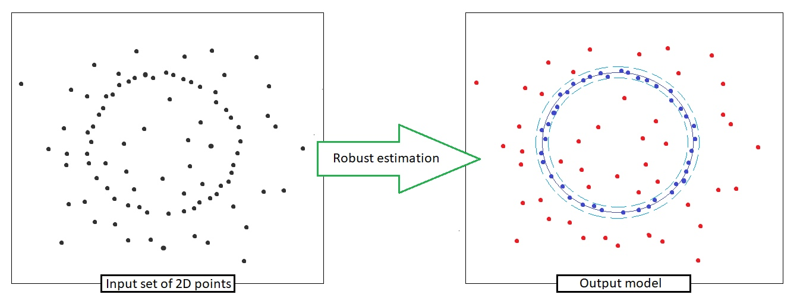

.. robest documentation master file, created by
   sphinx-quickstart on Sat Dec  1 22:56:11 2018.
   You can adapt this file completely to your liking, but it should at least
   contain the root `toctree` directive.

.. toctree::
   :maxdepth: 2

   pages/introduction
   pages/install
   pages/algorithms
   pages/tutorials
   pages/bibliography
   pages/contact

==================================
Welcome to robest's documentation!
==================================

What is *robest*?
-----------------

**robest** is a lightweight C++ library of robust estimators such as RANSAC or LMEDS. It helps solving issues with model fitting to noisy data containing outliers.

Why *robest*?
-------------

There are at least three main reasons why robest:

- First, the library is very light, and it makes wider the possible limits of its use.

- Secondly, due to its structure, robest is easy customizable: easy to add new estimation problem or new estimation algorithm. Follow our tutorial for more info

- Finally, the **robest** library is very compact - only 1 file. This allows you to quickly install it.

Cite Us
=======

If you use robest for a publication, please cite it as::

    @misc{robest,
      author = "Andrey Kudryavtsev and Mark Anisimov and Rahima Djahel and Sounkalo Dembélé",
      title = "robest",
      howpublished = "\url{https://github.com/avkudr/robest}",
    }

Dependencies
------------

There are none! Robest is a lightweight library contained in one header file.

Contributors
------------

* `Andrey Kudryavtsev <https://avkudr.github.io/>`_
* `Mark Anisimov <https://github.com/qM4RCp>`_
* `Rahima Djahel <https://github.com/rahma24000>`_
* `Sounkalo Dembélé <https://www.femto-st.fr/fr/personnel-femto/sounkalodembele>`_

.. Contents
.. ========

.. Indices and tables
.. ==================
   
.. * :ref:`genindex`
.. * :ref:`modindex`
.. * :ref:`search`

