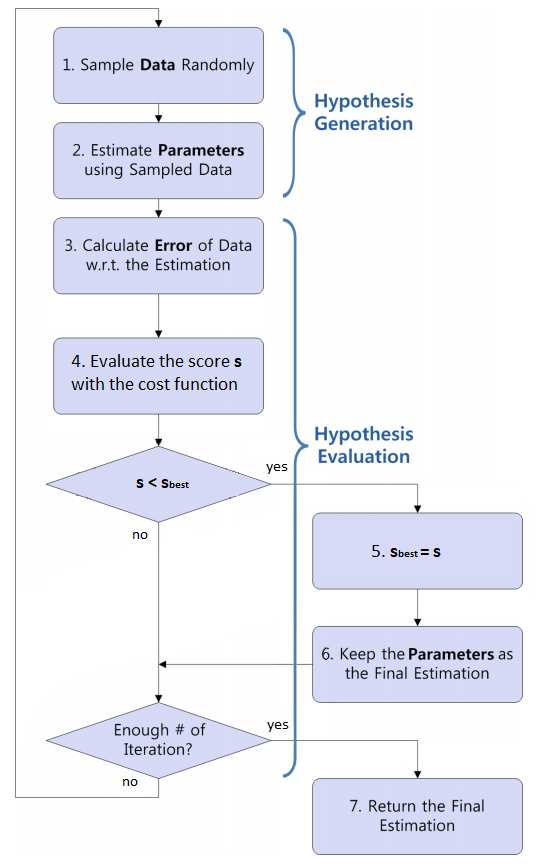
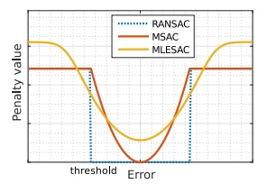

==================================
Algorithms
==================================

All methods of robust estiomation are iterative and based on a random selection of a small subset of samples which is used for model estimation.
Then, using their proper loss function, they obtain a score for the given model, i.e. how well the model fits to the data.
After a number of iterations, the model with the best score is retained as the solution of the problem. The general algorithm is presented in figure below.

Other Rabust estimators, such as MSAC or MLESAC, follow the similaire steps, the main difference between the methods is thier loss function.

RANSAC
======

The RANSAC (Random Sample Consensus) seeks to maximize the inliers ratio. The cost function is given as:

.. math:: 

   \begin{equation}
   \mathcal{C}_{RANSAC}(\mathcal{e}_i) =
   \begin{cases}
      0 & \text{$\varepsilon_{i}^2 < \mathcal{t}^2$} \\
      const & \text{otherwise}
   \end{cases}
   \end{equation}

where `t` is a threshold allowing to judge whether a given point is an inlier. 
We can see, that this algorithm does not take into account the quality of inliers as they all have the same cost.

LMedS
======

LMedS algorithm has the cost function which is defined as follows:

.. math:: 

   \mathcal{C}_{LMedS} = median(\mathcal{E}^2)

which shows that the goal of the algorithm is to minimize the median of errors. In order to give a reliable estimate,
the sample set must contain at least 50% of inliers, i.e. correct points. Remark, that the cost is estimated from 
the vector of errors which is no longer true for the remaining algorithms. For them, the cost is estimated for every data point
separately, while the global cost is obtained as the sum of this costs:

.. math::

   \mathcal{C} = \sum_{i=1}^{N_{pts}} \mathcal{C}(\varepsilon_{i})

M-SAC
======

MSAC, which stands for M-estimator Sample Consensus, is the algorithm in which every inlier have a penalty score given by how well the point corresponds to a model:

.. math:: 

   \begin{equation}
   \mathcal{C}_{MSAC}(\mathcal{e}_i) =
   \begin{cases}
      \varepsilon_{i}^2 & \text{$\varepsilon_{i}^2 < \mathcal{t}^2$} \\
      \mathcal{t}^2 & \text{otherwise}
   \end{cases}
   \end{equation}

