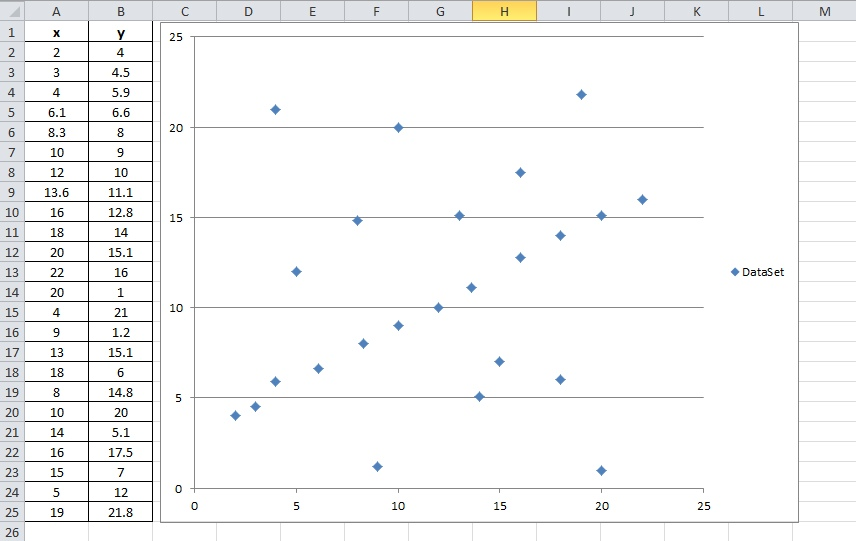

Line fitting to a set of 2D points
----------------------------------

Goal
~~~~

   In this tutorial you will learn how to fit the some set of 2D points by using the algorithms of Robest.

Task details
~~~~~~~~~~~~

   You have a set of 2d points, some of which (inliers) follow some rectilinear law. However, the data are
   quite corrupted and among all points there are so-called outliers. Thus, the main task is reduced to 
   the definition of this linear law and the search for inliers in the set of points.

   A set of 2D points is presented in the form of a table Excel.

Code
~~~~

   The tutorial code's is shown lines below.

.. code-block:: c++

   #include <sstream>
   #include <string>
   #include <fstream> 

   #include "LineFitting/LineFitting.hpp" 

   int main() 
   {
       // ***** Part 1: Reading the data.

       std::vector<double> x;  
       std::vector<double> y;

       std::ifstream file( "/DatasetOfPoints.csv" );
       std::string line = "";
       std::string value = "";
 
       while (getline(file, line))
       {
           value = "";
           for (int i = 0; i < line.size(); i++)
           {
               if (line[i] == ',' && i != 0) 
                   x.push_back(atof(value.c_str())); 

               if (i == line.size() - 1 && i != 0) 
                   y.push_back(atof(value.c_str()));
                
               line[i] != ',' ? value += line[i]:value = "";   
           }
       }
       file.close(); 

       // ***** Part 2: Define estimation problem.
    
       LineFittingProblem * lineFitting = new LineFittingProblem();
       lineFitting->setData(x,y);

       // ***** Part 3: Solve.

       robest::MSAC * MSACsolver = new robest::MSAC();
       MSACsolver->solve(lineFitting,0.02);        

       // ***** Part 4: Get parametres of the model.
	
       double res_k,res_b;
       lineFitting->getResult(res_k,res_b);

       std::cout << std::endl;
       std::cout << "Best model is: y = " << res_k << "*x + " << res_b;
       std::cout << std::endl;

       return 0;
   } 

Explanation
~~~~~~~~~~~

   - Including libraries
	
	.. code-block:: c++
	   
	   // tools for working with files
	   #include <sstream>
	   #include <string>
	   #include <fstream> 
	   
	   // line fitting algorithm
	   #include "LineFitting/LineFitting.hpp" 

   - Reading data set

	.. code-block:: c++
	   
	   int main() 
	   {
	       // ***** Part 1: Reading the data.

	       std::vector<double> x;  // vector of x coordiantes
	       std::vector<double> y;  // vector of y coordiantes
	       
	       // reading the file
	       std::ifstream file( "/DatasetOfPoints.csv" );
	       std::string line = "";
	       std::string value = "";
	 
	       // filling vectors
	       while (getline(file, line))
	       {
		   value = "";
		   for (int i = 0; i < line.size(); i++)
		   {
		       if (line[i] == ',' && i != 0) 
		           x.push_back(atof(value.c_str())); 

		       if (i == line.size() - 1 && i != 0) 
		           y.push_back(atof(value.c_str()));
		        
		       line[i] != ',' ? value += line[i]:value = "";   
		   }
	       }
	       file.close(); 

   - Estimation problem initialization

	.. code-block:: c++
	   
   	   // ***** Part 2: Define estimation problem.
    
           LineFittingProblem * lineFitting = new LineFittingProblem();
           lineFitting->setData(x,y);

   - Choosing the parameters of estimation algorithm

	As the main algorithm, we will use MSAC. At the input, 
	this method accepts a pointer to the estimation function, 
	a threshold value for determining the inliers, and also
	the number of iterations for which the model should be fitted.

	As a pointer, we have already defined the fit of the `lineFitting`.
	The threshold value will be 0.02. And to select the number of iterations,
	there are two ways:

	**First way**: we can manually set the value of the number of iterations.

	**The second way**: we can use the default value. It is calculated according to 
	the following formula:

	.. math::
	  
	   nbIter = \frac { log(1 - p) }{ log(1 - w^n) } 
	   
	Where *p* is the probability of successful completion of the algorithm,
	*w* is the inliers ratio, *n* is the size of the data set.

	It is worth noting that if the value of the number of iterations obtained
	as a result of automatic calculation will exceed 50000, the function 
	`calculateIterationsNb` will return the value of 50000.
	

   - Solving and analyse the results

	.. code-block:: c++

	        // ***** Part 3: Solve.

    	        robest::MSAC * MSACsolver = new robest::MSAC();
    	        MSACsolver->solve(lineFitting,0.02);     // threshold = 0.02   

    	        // ***** Part 4: Get parametres of the model.
	
    	        double res_k,res_b;
    	        lineFitting->getResult(res_k,res_b);

    	        std::cout << std::endl;
	        std::cout << "Best model is: y = " << res_k << "*x + " << res_b;
	        std::cout << std::endl;

	        return 0;
	    } 

		
	As parameters, the algorithm returns two values. So, a linear law
 	describing a given set of 2D points takes the following form:
	
	.. math::
	  
	   y(x) = 5.83333x + 3.16667

	In order to demonstrate the correctness of the calculated model, 
	we will use Excel. The result is shown in the figure below.

	.. image:: images/calculatedModel.jpg
	   :width: 653px
	   :height: 498px
	   :scale: 50 %
	   :alt: calculated model
	   :align: center

